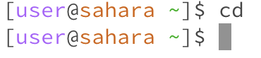
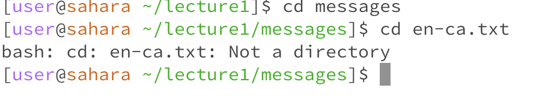
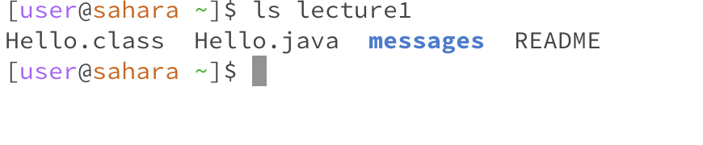
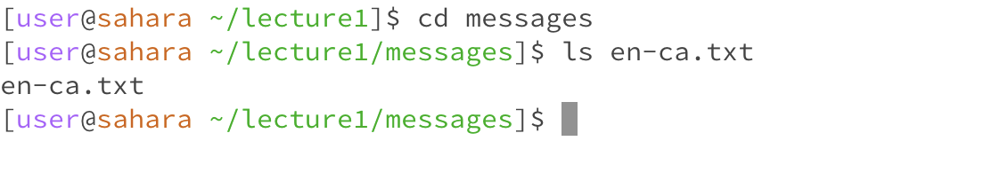
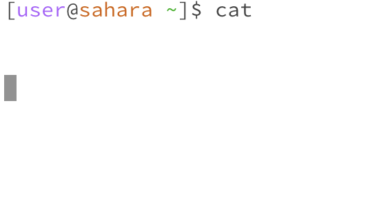
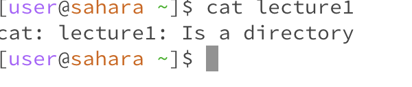
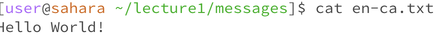

Hello, world!

# Lab Report 1

## cd

This is what happened when cd was entered into the terminal without an argument. It resets the directory to the original or default one. As it was already there, nothing happened.

This is what happened when cd was entered into the terminal with a path or directory as the argument. In this case the directory is essentially moved into lecture 1.

This is what happened when cd was entered with a file. It is not possible as cd only takes directories as arguments. As a file and not a directory this causes an error.

## ls

This is what happened when ls is used without an argument. A list of all the contents of the current directory is displayed.

This is what happened when ls is used with a path or directory. It lists the contents in that directory.

This is what happened when ls is used with a file. The file name is the only thing displayed in the output.

## cat

This is what happened when cat is used without any arguments. Nothing happens just a blank output is displayed.

This is what happened when cat is used with a path or directory. It doesn't work as the argument is a directory.

This is what happened when cat is used with a file. It displays the text in the file.

