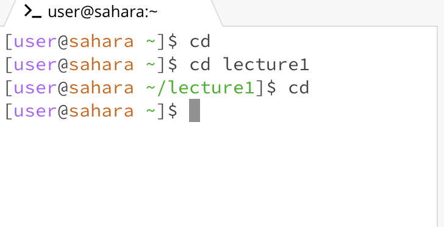

Hello, world!

# Lab Report 1

## cd

This is what happened when cd was entered into the terminal without an argument. It resets the directory to the original or default one. As it was already there, nothing happened. The working directory was the default one when the command was run. cd without an argument resets the directory to the default one. Therefore, it appears like nothing happened. This is not an error.

This is what happens when cd is used without an argument and lecture1 is the directory. It resets to the default directory. The working directory was lecture1 and is now the default one. This happens as cd without an argument resets the directory to the default one. The output is clearly not an error. the working driectory was lecture1 or the default one.

This is what happened when cd was entered into the terminal with a path or directory as the argument. In this case the working directory is updated to lecture 1. The working directory was the default one and is now lecture1. This happeneded as cd changes the directory to /lecture1. This is clearly not an error as the diretcory is changed appropriately

This is what happened when cd was entered with a file. It is not possible as cd only takes directories as arguments. This happens as a directory can only be in the form of a folder. As a file and not a directory this causes an error. This happens because a folder isn't the input and a file is, which is the wrong type of argument. The working directory is updated to /lecture1/messages and then attempted to be updated to a text file and fails.

## ls

This is what happened when ls is used without an argument. A list of all the contents of the current directory is displayed. This happens because ls means list and thus, a list of all the files and folders that are in the working directory are displayed. This is clearly not an error. The working directory is the default one on edstem.

This is what happened when ls is used with a path or directory. It lists the contents in that directory. This happens because this list fucntion lists all the files and folders in that diretcory that is called in lecture1. The output is clealry not an error. The working directory is still the default one but the contents of the directory lecture1 are displayed

This is what happened when ls is used with a file. The file name is the only thing displayed in the output. This isn't an error as the terminal cant read whats inside a file. It can only tell you it exists. Since it's a file and not a path, the files inside arent displayed. therefore, it's clearly not an error but the result is rather useless. The working diretcory is changed to /lecture1/messages.

## cat

This is what happened when cat is used without any arguments. Nothing happens just a blank output is displayed. cat also just duplicates any input that is typed. although there is no screenshot, if eg 'hello' is typed, hello will also be displayed in the next line as thisn is the deault function of cat. This is clearly not an error but not a very helpful fucntion nonetheless. The working directory is the default one.

This is what happened when cat is used with a path or directory. It doesn't work as the argument is a directory. This is because the fucntion of cat is to display text in files and notn paths not directories. Thus, an error appears as it's not possibel to display what's in a directory with the cat fucntion. a better option is to use ls with the same argument. the working directory is the default one.

This is what happened when cat is used with a file. It displays the text in the file. teh content of the text file is displayed very easily as per the explained function of cat above. It allows for us to see whats in the file without opening it. This is clealry not an error but a helpful function. The working directory is /lecture1/messages. 

