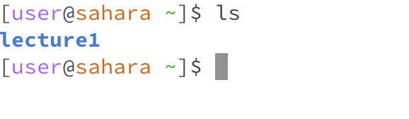

Hello, world!

# Lab Report 1

## cd

This is what happened when cd was entered into the terminal without an argument. It resets the directory to the original or default one. As it was already there, nothing happened.

This is what happened when cd was entered into the terminal with a path or directory as the argument. In this case the directory is essentially moved into lecture 1.

This is what happened when cd was entered w a file. It is not possible as cd only takes directories as arguments. As a file and not a directory this causes an error.

## ls

This is what happened when ls is used without an argument. A list of all the contents of the current directory is displayed.

This is what happened when ls is used w a path or directory. it lists the contents in that directory.

This is what happened when ls is used w a file. 

